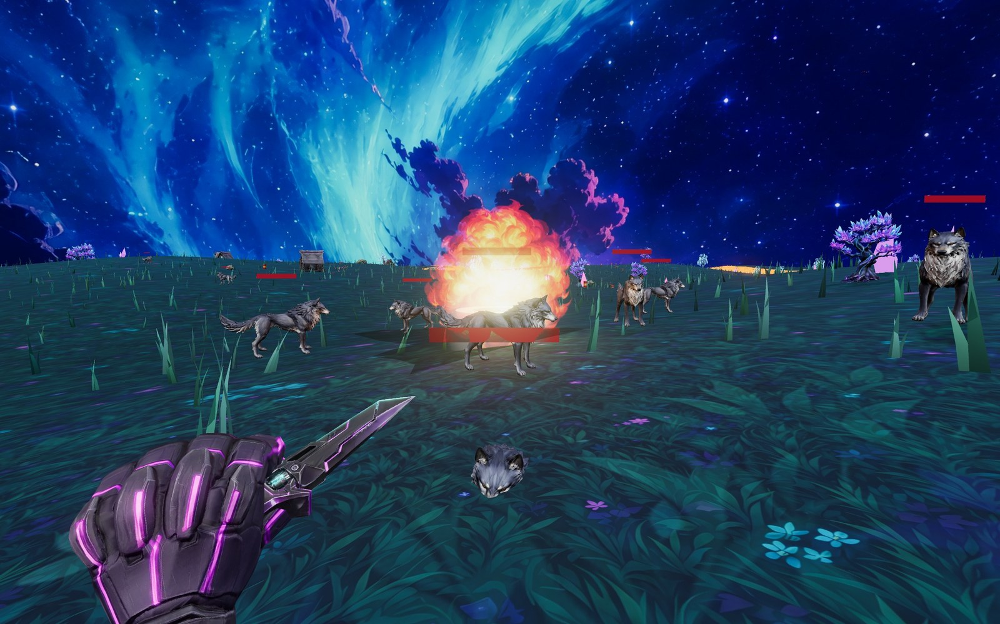

<p align="center">
  
</p>

<h1 align="center">BAZOOKA WORLD</h1>

<p align="center">
  바주카포 하나로 모든 것을 폭파시키는 <b>오픈월드 FPS RPG</b><br>
  사이버펑크 밤의 판타지 월드에서 늑대 무리에 맞서 살아남으세요.<br>
  <sub>Three.js 단일 HTML 파일로 만든 브라우저 게임 · 설치 불필요</sub>
</p>

---

## 🎬 티저

<p align="center">
  
</p>

> 고화질 영상: [docs/teaser.mp4](docs/teaser.mp4)

## 🎮 게임플레이

<p align="center">
  
</p>

밤의 오로라 아래, 크리스탈 트리가 빛나는 개활지에서 시작합니다. 시간이 지날수록 늑대 무리가 불어나고, 탄약은 유한합니다 — 로켓이 떨어지면 블레이드로 버티며 보급 상자를 찾아야 합니다.

| 조작 | 동작 |
|---|---|
| `W A S D` | 이동 |
| `마우스` | 시점 회전 |
| `좌클릭` | 로켓 발사 / 블레이드 찌르기 |
| `우클릭` | 조준 (줌) |
| `Q` / `1` / `2` | 무기 교체 (바주카 ⇄ 블레이드) |
| `SHIFT` | 질주 |
| `SPACE` | 점프 |
| `ESC` | 일시정지 |

## ✨ 특징

- **유한 탄약 생존 루프** — 자동 재장전 없음. 로켓은 보급 상자(칼로도 개봉 가능)와 레벨업으로만 보급됩니다. 탄이 떨어지면 사이버펑크 블레이드로 근접전 — 일반 늑대는 정확히 3방.
- **시간 난이도 스케일링** — 30초마다 늑대 상한이 증가(최대 96마리). 오래 버틸수록 전장이 거칠어집니다.
- **화이트 울프** — 12% 확률로 등장하는 희귀 개체. 더 크고(×1.35) 단단하고(HP ×2.2) 아프지만(공격 ×1.8), 경험치 구슬 3배 + 탄창 2개 확정 드랍.
- **용암 외곽 경계** — 맵 가장자리는 이글거리는 용암지대. 접근하면 화면 경고와 함께 체력이 급감합니다.
- **RPG 성장** — 처치·파괴로 XP 획득, 레벨업마다 체력·로켓 보유량·폭발력 강화. 퀘스트 체인 포함.
- **물리 파괴** — 오두막·군용 트럭·배럴(연쇄 유폭)·크리스탈 트리·바위 전부 폭파 가능. 파편·그을음·넉백까지.

## 📸 스크린샷

| | |
|---|---|
|  |  |
| 늑대 무리와의 교전 | 로켓 폭발 |

<p align="center">
  <br>
  <sub>사이버펑크 블레이드 근접전 — 1인칭 풀암 뷰모델</sub>
</p>

## 🚀 실행 방법

**방법 1 — 스탠드얼론 (권장)**
[`bazooka-standalone.html`](bazooka-standalone.html) 파일 하나를 브라우저로 열면 끝. 모든 에셋(텍스처·3D 모델·사운드)이 인라인된 단일 파일입니다.

**방법 2 — 개발용**
```bash
python3 -m http.server 4859
# http://localhost:4859/index.html
```

## 🛠 기술 스택

- **Three.js r160** — WebGL 렌더링, UnrealBloom 포스트프로세싱, ACES 톤매핑
- **절차적 시스템** — InstancedMesh 잔디 26k(바람 셰이더), 버텍스 셰이더 늑대 갤럽, 상태 기반 AI(배회/추격/도약)
- **AI 생성 에셋 파이프라인** — Krea(GPT Image 2 / Nano Banana Pro) 텍스처·키아트 → Meshy 3D 변환(늑대·바주카·블레이드·오두막·트럭·크리스탈 트리·로켓·FPS 팔) → gltf-transform 최적화(meshopt + WebP)
- **성능** — 픽셀 예산 기반 해상도 관리 + FPS 적응형 동적 해상도, 대형 화면에서도 부드럽게

## 📦 빌드

```bash
python3 build-standalone.py   # index.html + assets/ → bazooka-standalone.html
```
