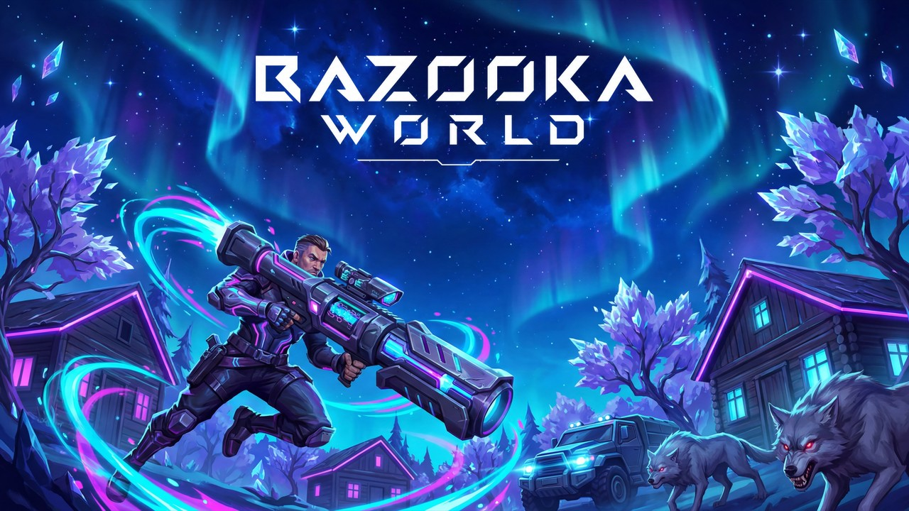
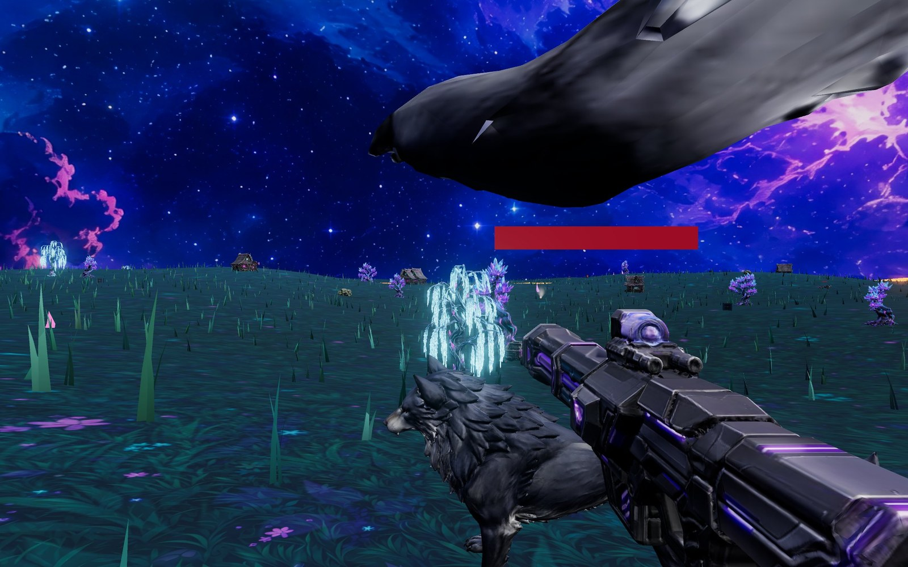
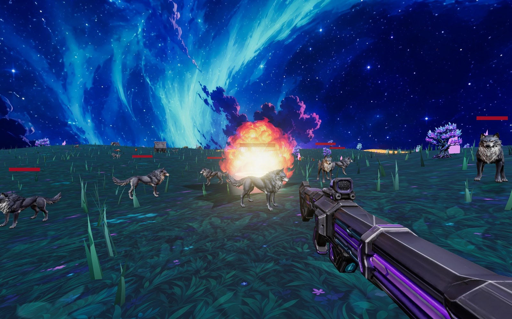

<p align="center">
  
</p>

<h1 align="center">BAZOOKA WORLD</h1>

<p align="center">
  바주카포 하나로 모든 것을 폭파시키는 <b>오픈월드 FPS RPG</b><br>
  사이버펑크 판타지 월드에서 늑대 무리에 맞서 살아남는 게임입니다.<br>
  <sub>Three.js 단일 HTML 파일로 만든 브라우저 게임 · 설치 불필요</sub>
</p>

<p align="center">
  <a href="https://bazooka-world.vercel.app">
    
  </a>
</p>

---

## 게임플레이

<p align="center">
  
</p>

| 조작 | 동작 |
|---|---|
| `W A S D` | 이동 |
| `마우스` | 시점 회전 |
| `좌클릭` | 로켓 발사 / 블레이드 찌르기 |
| `우클릭` | 조준 (줌) |
| `Q` / `1` / `2` | 무기 교체 (바주카 ⇄ 블레이드) |
| `SHIFT` | 질주 |
| `SPACE` | 점프 |
| `ESC` | 일시정지 |

## 특징

- **유한 탄약**: 자동 재장전이 없습니다. 로켓은 보급 상자와 레벨업으로만 채울 수 있고, 상자는 칼로도 열립니다. 일반 늑대는 세 번 찌르면 잡힙니다.
- **난이도 스케일링**: 30초마다 늑대 수 상한이 올라갑니다. 최대 96마리까지 불어납니다.
- **화이트 울프**: 낮은 확률로 나오는 희귀 개체입니다. 크고 튼튼하고 공격도 아프지만, 잡으면 경험치 구슬 3배와 탄창 2개를 확정으로 떨굽니다.
- **용암 경계**: 맵 가장자리는 용암지대라 넘어갈 수 없습니다. 가까이 가면 경고가 뜨고 체력이 깎입니다.
- **RPG 성장**: 처치와 파괴로 경험치를 얻고, 레벨이 오르면 체력, 로켓 보유량, 폭발력이 강해집니다. 퀘스트 체인도 있습니다.
- **파괴 가능한 월드**: 오두막, 군용 트럭, 배럴(연쇄 폭발), 크리스탈 트리, 바위를 전부 부술 수 있습니다.

## 스크린샷

| | |
|---|---|
|  |  |
| 늑대 무리와의 교전 | 로켓 폭발 |

## 실행 방법

**온라인 (권장)**
브라우저에서 바로 플레이할 수 있습니다: **https://bazooka-world.vercel.app**

**스탠드얼론**
[`bazooka-standalone.html`](bazooka-standalone.html) 파일을 내려받아 브라우저로 열어도 됩니다. 모든 에셋이 한 파일에 들어 있어 오프라인에서도 실행됩니다.

**로컬 개발**
```bash
python3 -m http.server 4859
# http://localhost:4859/index.html
```

## 기술 스택

- **Three.js r160**: WebGL 렌더링, UnrealBloom 포스트프로세싱, ACES 톤매핑
- **절차적 시스템**: InstancedMesh 잔디 26k(바람 셰이더), 버텍스 셰이더 늑대 갤럽, 상태 기반 AI(배회/추격/도약)
- **AI 생성 에셋**: Krea로 텍스처와 키아트를 만들고 Meshy로 3D 변환한 뒤 gltf-transform으로 최적화(meshopt + WebP)했습니다. 늑대, 바주카, 블레이드, 오두막, 트럭, 크리스탈 트리, 로켓, FPS 팔이 이 파이프라인으로 제작됐습니다.
- **성능**: 픽셀 예산 기반 해상도 관리와 FPS 적응형 동적 해상도를 씁니다.

## 빌드

```bash
python3 build-standalone.py   # index.html + assets/ → bazooka-standalone.html
```
